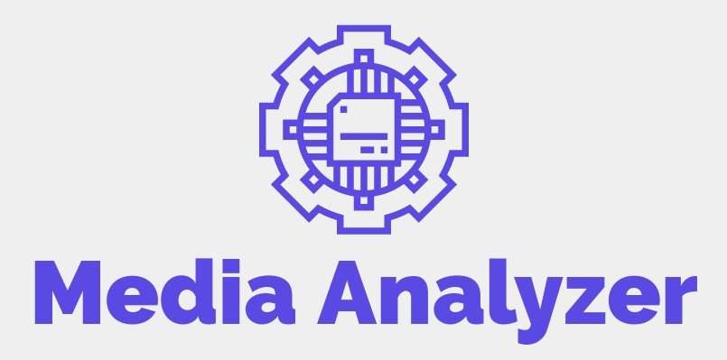

<!-- PROJECT BADGES -->
 

<!-- PROJECT LOGO -->
 

<h3 align="center">media-analyzer</h3>

  

    A Twitter stream analyzer
     
    <a href="https://joshuam1008.github.io/media-analyzer/#project-documentation"><strong>Explore the docs »</strong></a>
     
     
    <a href="https://joshuam1008.github.io/media-analyzer/#short-video">View Demo</a>
    ·
    <a href="https://github.com/joshuam1008/media-analyzer/issues/new/choose">Report Bug</a>
    ·
    <a href="https://github.com/joshuam1008/media-analyzer/issues/new/choose">Request Feature</a>
  

<!-- TABLE OF CONTENTS -->

  
Table of Contents

  <ol>
    <li>
      <a href="#about-the-project">About The Project</a>
      <ul>
        <li><a href="#built-with">Built With</a></li>
      </ul>
    </li>
    <li>
      <a href="#getting-started">Getting Started</a>
      <ul>
        <li><a href="#installation">Installation</a></li>
      </ul>
    </li>
    <li><a href="#usage">Usage</a></li>
    <li><a href="#roadmap">Roadmap</a></li>
    <li><a href="#contributing">Contributing</a></li>
    <li><a href="#license">License</a></li>
    <li><a href="#contact">Contact</a></li>
    <li><a href="#acknowledgments">Acknowledgments</a></li>
  </ol>

<!-- ABOUT THE PROJECT -->
## About The Project

[![Contributors][contributors-shield]][contributors-url]
[![Forks][forks-shield]][forks-url]
[![Stargazers][stars-shield]][stars-url]
[![Issues][issues-shield]][issues-url]

![Product Name Screen Shot][product-screenshot]

A tool to perform sentiment analysis (positive, negative, neutral) on a live Twitter stream, filtered by language and keywords.

To build this program, we are using the Twitter API to pull in a stream of tweets which are placed in a queue to be processed. The list of tweets is processed by the deep learning model that has been fine tuned on sentiment classification. The tweet ID is then given an associated sentiment prediction that is output to the stream. The overall sentiment is held in a histogram to show the user the normal sentiment over the stream.

(<a href="#readme-top">back to top</a>)

### Built With

* [![Bootstrap][Bootstrap.com]][Bootstrap-url]
* [![Django][Django.com]][Django-url]
* [![Python][Python.com]][Python-url]
* [![PyTorch][PyTorch.com]][PyTorch-url]
* [![Scikit-learn][Scikitlearn.com]][Scikitlearn-url]
* [![JavsScript][JavaScript.com]][JavaScript-url]

(<a href="#readme-top">back to top</a>)

<!-- GETTING STARTED -->
## Getting Started

Read through this `README` to find all relevant information and locations of other guides to get started.

### Installation

Follow the steps listed in the [installation guide](INSTALL.md)

(<a href="#readme-top">back to top</a>)

<!-- USAGE EXAMPLES -->
## Usage

Examples and descriptions of how the project can be used are available at the [project overview](https://joshuam1008.github.io/media-analyzer/).

(<a href="#readme-top">back to top</a>)

<!-- ROADMAP -->
## Roadmap

- [x] Iteration 1: Display Twitter stream
- [x] Iteration 2: Overall sentiment on stream
- [x] Iteration 3: Filter Twitter stream by language
- [ ] Iteration 4: Single sentiment Analysis
- [ ] Iteration 5: Filter stream by keyword
- [ ] Iteration 6: Filter stream by topic
- [ ] Iteration 7: Bot detection

See the [full future roadmap](https://github.com/users/joshuam1008/projects/3)

See the [open issues](https://github.com/joshuam1008/media-analyzer/issues) for a full list of proposed features (and known issues).

(<a href="#readme-top">back to top</a>)

<!-- CONTRIBUTING -->
## Contributing

Contributions are what make the open source community such an amazing place to learn, inspire, and create. Any contributions you make are **greatly appreciated**.

If you have a suggestion that would make this better, please fork the repo and create a pull request. You can also simply open an issue with the tag "enhancement".
Don't forget to give the project a star! Thanks again!

1. Fork the Project
2. Create your Feature Branch (`git checkout -b feature/AmazingFeature`)
3. Commit your Changes (`git commit -m 'Add some AmazingFeature'`)
4. Push to the Branch (`git push origin feature/AmazingFeature`)
5. Open a Pull Request

See [detailed instructions here](CONTRIBUTING.md)

(<a href="#readme-top">back to top</a>)

<!-- LICENSE -->
## License

Distributed under the GNU GPL-3.0 License. See [LICENSE](LICENSE) for more information.

(<a href="#readme-top">back to top</a>)

<!-- CONTACT -->
## Contact

For reporting a conduct issue, see the Enforcement sectiong of our [code of conduct](CODE_OF_CONDUCT.md)

Project Link: [https://github.com/joshuam1008/media-analyzer](https://github.com/joshuam1008/media-analyzer)

(<a href="#readme-top">back to top</a>)

<!-- ACKNOWLEDGMENTS -->
## Acknowledgments

* README is based off of [this template](https://github.com/othneildrew/Best-README-Template)

(<a href="#readme-top">back to top</a>)

<!-- MARKDOWN LINKS & IMAGES -->
<!-- https://www.markdownguide.org/basic-syntax/#reference-style-links -->
[contributors-shield]: https://img.shields.io/github/contributors/joshuam1008/media-analyzer.svg?style=for-the-badge
[contributors-url]: https://github.com/joshuam1008/media-analyzer/graphs/contributors
[forks-shield]: https://img.shields.io/github/forks/joshuam1008/media-analyzer.svg?style=for-the-badge
[forks-url]: https://github.com/joshuam1008/media-analyzer/network/members
[stars-shield]: https://img.shields.io/github/stars/joshuam1008/media-analyzer.svg?style=for-the-badge
[stars-url]: https://github.com/joshuam1008/media-analyzer/stargazers
[issues-shield]: https://img.shields.io/github/issues/joshuam1008/media-analyzer.svg?style=for-the-badge
[issues-url]: https://github.com/joshuam1008/media-analyzer/issues

[product-screenshot]: images/project-view.png

[Bootstrap.com]: https://img.shields.io/badge/Bootstrap-563D7C?style=for-the-badge&logo=bootstrap&logoColor=white
[Bootstrap-url]: https://getbootstrap.com
[Django.com]: https://img.shields.io/badge/Django-092E20?style=for-the-badge&logo=django&logoColor=white
[Django-url]: https://www.djangoproject.com/
[Python.com]: https://img.shields.io/badge/Python-3776AB?style=for-the-badge&logo=python&logoColor=white
[Python-url]: https://www.python.org/
[PyTorch.com]: https://img.shields.io/badge/PyTorch-EE4C2C?style=for-the-badge&logo=pytest&logoColor=white
[PyTorch-url]: https://pytorch.org/
[Scikitlearn.com]: https://img.shields.io/badge/scikit-learn-F7931E?style=for-the-badge&logo=scikit-learn&logoColor=white
[Scikitlearn-url]: https://scikit-learn.org/stable/
[JavaScript.com]: https://img.shields.io/badge/JavaScript-F7DF1E?style=for-the-badge&logo=javascript&logoColor=black
[JavaScript-url]: https://www.javascript.com/

<!--
# Pending Development Plan
| Iteration 1                 | Iteration 2                       | Iteration 3               | Iteration 4              | Iteration 5            | Iteration 6   |
| --------------------------- | --------------------------------- | ------------------------- | ------------------------ | ---------------------- | ------------- |
| Display Twitter stream      | Filter Twitter stream by language | Single sentiment Analysis | Filter stream by keyword | Filter stream by topic | Bot detection |
| Overall sentiment on stream |                                   |                           |                          |                        |               |
|                             |                                   |                           |                          |                        |               |

deployment 
https://sheltered-citadel-93242.herokuapp.com/twitter/
currently using server side rendering, thus need to refresh page to get new stream

api 
post "/twitter/fetch_result"
1.fetch_result type post
expected json in backend

{"id":[id1,id2,id3],"category":['stream','sentiment','lang en']}

id represent result of twitter you requested on.
category is the type of result you requested.
stream: if you request stream, the data in stream cache will be fetched along with other results you requested in category

expected response for front end

{"stream":[id:{'sentiment':0,'lang':'en'}....],"inds": ["id1":{'sentiment':0,'lang':'en'}, "id2":{'sentiment':None,'lang':None}....]}

I seperate stream with requested tweet so the stream can be appended to frontend easier.
None means the backend will give it to you in the future.
so in the next round you can call again to get the result.

{"id":[id],"category":['stream','sentiment','lang en']}
-->
